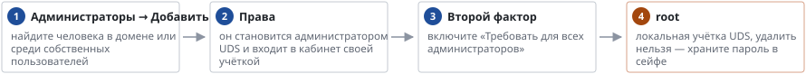

# Администраторы кабинета

*Руководство администратора → Безопасность*

> Кто может входить в кабинет, второй фактор для администраторов, главный администратор root.

Все действия администраторов пишутся в аудит с именем. Уведомление «Вход администратора» сообщит о каждом входе в кабинет.

---
[Оглавление](README.md)
