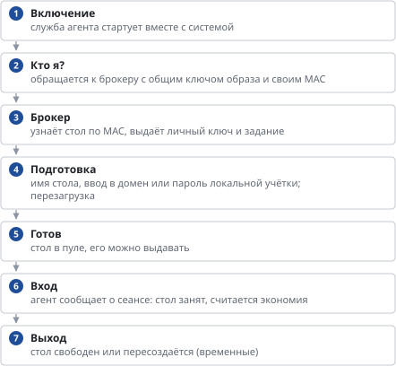
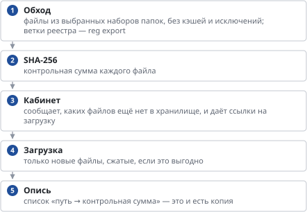

# Агенты на рабочих столах

*Как устроено*

> Какие агенты работают на столах, что они делают и как их проверить.

На каждом рабочем столе работают два агента. **Агент UDS** отвечает за жизнь стола в брокере: имя, домен, готовность, сеансы. **Агент «Программы и настройки»** (агент VDI) — за то, что настраивает администратор в кабинете: программы, файлы, сертификаты и профили сотрудников в S3. Агенты независимы: сбой одного не мешает другому, и оба не хранят на столе ни паролей администратора, ни ключей хранилища.

| Агент | Что делает | Где на столе | Откуда |
|----|----|----|----|
| **Агент UDS 5** | находит свой стол в брокере по MAC-адресу, переименовывает стол, вводит в домен или задаёт пароль локальной учётки, сообщает о готовности, входе и выходе сотрудника; выполняет команды брокера (сообщение, снимок экрана, выход из сеанса) | Windows: служба UDSActorService, C:\Program Files\UDSActor; Linux: служба udsactor, /etc/udsactor/udsactor.cfg | OpenUDS 5 (Rust, BSD-3), собран нами с патчами cloududs/actor/patches (пароль локальной учётки, сборка для Astra) |
| **Агент «Программы и настройки» (VDI)** | ставит программы, раскладывает файлы и сертификаты из кабинета, сохраняет и возвращает профиль сотрудника (S3), обновляется сам | Windows: C:\ProgramData\VDIAgent (PowerShell 5.1); Linux: /opt/vdi-agent, /etc/vdi-agent (Python 3) | наш код: panel/agent/vdi-agent.ps1, vdi-agent.py |
| **Скрипт мгновенных клонов (только эталоны vSphere)** | «замораживает» версию пула для мгновенных клонов и готовит каждый клон: сеть, время, запуск агента UDS | C:\ProgramData\UDSInstantClone, задача «UDS Instant Clone» | images/windows/uds-instantclone.ps1 |
| **Агент серверов (не на столах)** | каждые 30 с отправляет в кабинет состояние сервера: CPU, память, диски, службы, контейнеры, базу данных | серверы вокруг брокера: служба vdi-hostagent | panel/agent/vdi-hostagent.py |

### 1. Агент UDS: от включения стола до входа сотрудника

Общий ключ (master token) зашит в эталон и годится только для регистрации: чужую машину по нему не зарегистрировать — брокер отвечает лишь столам, которые сам создал (он знает их MAC). Дальше агент работает по личному ключу стола. Соединение — HTTPS к брокеру (/uds/rest/actor/v3); брокер обращается к агенту для подготовки подключения, снимка экрана и сообщений пользователю. Что именно делать при подготовке, задаёт «менеджер ОС» пула: ввод в домен (имя стола — по шаблону пула, учётка ввода — из раздела «Пользователи») или локальная учётка со случайным паролем для входа без домена.

### 2. Агент «Программы и настройки»: четыре этапа

| Этап | Когда запускается | От чьего имени | Что делает |
|----|----|----|----|
| **machine** | при загрузке и каждые 5 минут (Windows — задача планировщика «VDI Agent», Linux — таймер vdi-agent.timer) | система (SYSTEM / root) | регистрация стола; программы, сертификаты, файлы для всего стола; самообновление; проверяет, что на месте сценарии входа/выхода и задача пользователя |
| **user** | при входе сотрудника (Windows — задача «VDI Agent (user)», Linux — автозапуск XDG) и дальше весь сеанс | сотрудник | файлы в профиль (например, список баз 1С с его ФИО); каждые N минут сохраняет профиль; раз в 5 минут проверяет заявки «восстановить в папку» |
| **profile-logon** | при входе, до запуска Проводника и программ (Windows — сценарий входа локальной групповой политики, синхронно; Linux — PAM pam_exec в xrdp-sesman) | сотрудник | возвращает профиль из S3: файлы и ветки реестра HKCU |
| **profile-logoff** | при выходе (сценарий выхода / PAM close_session) | сотрудник | финальное сохранение профиля в S3 |

**Регистрация.** В эталоне лежит ключ регистрации арендатора (enroll.key, доступен только SYSTEM/root). Этап machine предъявляет его вместе с именем стола; кабинет выдаёт личный токен стола, только если UDS знает стол с таким именем. Токен лежит в agent.json (его читают этапы пользователя). Стол переименован или токен отозван — агент регистрируется заново сам.

**Программы, файлы, сертификаты.** Агент берёт у кабинета список назначенного (пулу или сотруднику) и применяет только то, что изменилось с прошлого раза (номер ревизии). Файлы скачиваются по SHA-256 и проверяются; программы ставятся тихо (MSI — msiexec /qn, EXE — с ключами из карточки; Linux — dnf / apt-get / rpm), сертификаты — в хранилище компьютера (Windows) или update-ca-trust / update-ca-certificates. Результат по каждому элементу виден на его карточке в кабинете.

### 3. Профиль в S3: как устроено сохранение

**Без ключей на столе.** Агент не знает ключей S3: кабинет выдаёт одноразовые подписанные ссылки и только на файлы того, кому выдан стол (владельца кабинет берёт из UDS, а не из слов агента). В бакете файлы лежат под контрольными суммами (\<логин\>/\<ОС\>/b/\<sha256\>), копии — описи (s/\<время\>.json.gz); одинаковый файл хранится один раз. Найти и скачать файл по имени — «Профили пользователей» → сотрудник → «Файлы».

**Режимы.** «Резервная копия» (личные столы): профиль живёт на столе, агент сохраняет его и возвращает недостающее, если стол пересоздан. «Перенос профиля» (временные столы): при входе профиль загружается целиком, при выходе сохраняется; если временный стол достался другому сотруднику, файлы предыдущего из сохраняемых папок удаляются до загрузки. Режим задаётся пулу или выбирается автоматически по типу стола.

**Ограничения и хранение.** Лимит профиля (по умолчанию 10 ГБ) и размер одного файла (512 МБ) — в настройках раздела. Последние 2 дня хранятся все копии, дальше — по одной в день до срока хранения (по умолчанию 30 дней); последняя копия не удаляется никогда; файлы, на которые не ссылается ни одна копия, удаляются из бакета. Сохранения на одном столе не пересекаются (блокировка), вход никогда не блокируется ошибкой агента — только запись в журнал.

### 4. Из чего собран агент

|  | Windows | Linux (РЕД ОС, Astra, Альт) |
|----|----|----|
| **Язык** | Windows PowerShell 5.1 (есть в каждой Windows 10/11), без модулей из интернета | Python 3, только стандартная библиотека |
| **Запуск** | Планировщик заданий; сценарии входа/выхода локальной групповой политики (scripts.ini, синхронный вход) | systemd (таймер и служба), автозапуск XDG, PAM pam_exec + runuser |
| **Сеть** | .NET HttpWebRequest / Invoke-RestMethod, TLS 1.2 | urllib, ssl |
| **Файлы и сжатие** | .NET SHA-256, GZipStream, reg.exe export/import для веток HKCU | hashlib, gzip, fcntl (блокировка) |
| **Программы и сертификаты** | msiexec, Import-Certificate | dnf / apt-get / rpm, openssl, update-ca-trust |
| **Кабинет (сервер)** | API /admin/agent/…: enroll, manifest, file, report, self, profile/config · begin · commit · restore · restored | подписи ссылок S3 (AWS SigV4) и учёт копий — в базе кабинета |

### 5. Установка, журналы, проверка

**Установка** — одной командой из «Образы» → «Свой образ» (вместе с агентом UDS) или отдельно командой агента; для ВМ без доступа к кабинету и для SCCM/GPO/Ansible — офлайн-архивы «Программы» → «Скачать агенты». Агент VDI обновляется сам в течение 5 минут после обновления кабинета; агент UDS — только вместе с образом. **Как обновляются агенты**

|  | Windows | Linux |
|----|----|----|
| **Журнал системы** | C:\ProgramData\VDIAgent\agent.log | /var/log/vdi-agent.log |
| **Журнал сотрудника** | %LOCALAPPDATA%\VDIAgent\agent.log | ~/.cache/vdi-agent/agent.log |
| **Запустить сейчас** | schtasks /run /tn "VDI Agent" | systemctl start vdi-agent.service |
| **Зарегистрировать заново** | удалить token из agent.json и запустить | то же в /etc/vdi-agent/agent.json |
| **Агент UDS** | служба UDSActorService, журнал — в карточке стола в UDS | служба udsactor |

**Ошибки агентов** видны в кабинете: «Программы и настройки» (по элементам и столам), «Профили пользователей» → сотрудник → «Журнал агента», состояние столов — в «Поиске».

---
[Оглавление](README.md)
