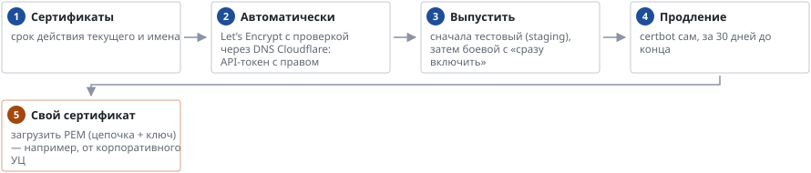

# Сертификат сайта

*Обслуживание*

> Сертификат сайта портала: Let’s Encrypt, свой сертификат, корни для узлов.

**Схема текстом:**

1.  **Сертификаты** — срок действия текущего и имена
2.  **Автоматически** — Let’s Encrypt с проверкой через DNS Cloudflare: API-токен с правом Zone.DNS:Edit
3.  **Выпустить** — сначала тестовый (staging), затем боевой с «сразу включить»
4.  **Продление** — certbot сам, за 30 дней до конца
5.  **Свой сертификат** — загрузить PEM (цепочка + ключ) — например, от корпоративного УЦ (внимание)

При неудачном выпуске текущий сертификат остаётся. Сертификат нужен и клиенту UDS: с самоподписанным приложение предупреждает сотрудника при каждом подключении.

---
[Оглавление](README.md)
