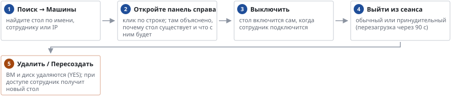

# Как выключить, освободить или удалить стол

*Руководство администратора → Ежедневная работа*

> Выключить, освободить, пересоздать или удалить отдельный стол.

**Схема текстом:**

1.  **Поиск → Машины** — найдите стол по имени, сотруднику или IP
2.  **Откройте панель справа** — клик по строке; там объяснено, почему стол существует и что с ним будет
3.  **Выключить** — стол включится сам, когда сотрудник подключится
4.  **Выйти из сеанса** — обычный или принудительный (перезагрузка через 90 с)
5.  **Удалить / Пересоздать** — ВМ и диск удаляются (YES); при доступе сотрудник получит новый стол (внимание)

Временные столы и столы старой версии образа UDS удаляет сам после выхода пользователя.

---
[Оглавление](README.md)
