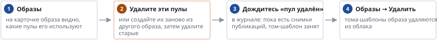

# Как удалить образ

*Руководство администратора → Образы и пулы*

> Почему кнопка «Удалить» у образа бывает неактивна и как освободить образ.

> **⚠ Внимание.**
>
> Кнопка «Удалить» у образа неактивна, пока образ используется хотя бы одним пулом.

Образы поставки (встроенные) не удаляются, а убираются из каталога: их тома-шаблоны остаются в облаке и могут быть возвращены администратором.

---
[Оглавление](README.md)
