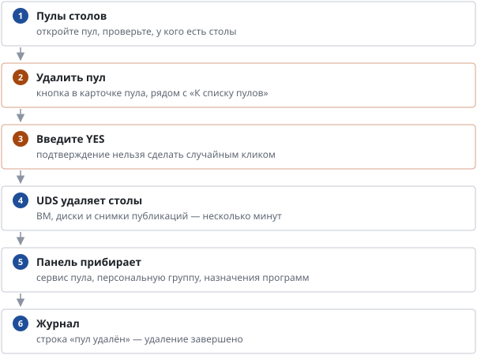

# Как удалить пул

*Руководство администратора → Образы и пулы*

> Удаление пула вместе со столами и всё, что кабинет приберёт за ним.

> **⚠ Внимание.**
>
> Все столы пула удаляются вместе с данными пользователей. Предупредите сотрудников заранее.

---
[Оглавление](README.md)
