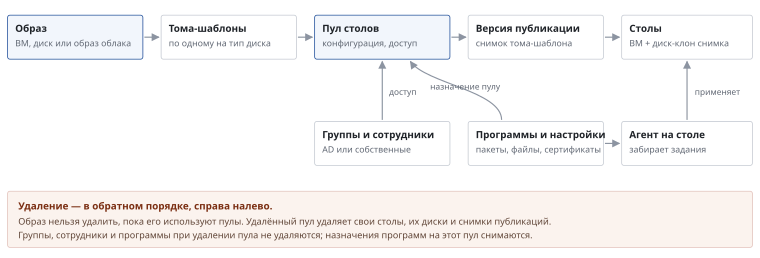

# Что от чего зависит

*Как устроено*

> Что нужно создать раньше чего: образ, каталог, пул, доступ — и что ломается, если удалить звено.

**Схема текстом:**

- Цепочка создания: **образ** (ВМ, диск или образ облака) → **тома-шаблоны** (по одному на тип диска) → **пул столов** (конфигурация, доступ) → **версия публикации** (снимок тома-шаблона) → **столы** (ВМ + диск-клон снимка).
- **Группы и сотрудники** (AD или собственные) дают доступ к пулу.
- **Программы и настройки** (пакеты, файлы, сертификаты) назначаются пулу; **агент на столе** забирает задания и применяет их.
- Удаление — в обратном порядке, справа налево. Образ нельзя удалить, пока его используют пулы. Удалённый пул удаляет свои столы, их диски и снимки публикаций.
- Группы, сотрудники и программы при удалении пула не удаляются; назначения программ на этот пул снимаются.

Стол всегда создаётся из версии публикации пула: в VK Cloud это снимок тома-шаблона образа (в опции VMware vSphere — полная копия эталонной ВМ со снимком). Пока в пуле есть столы старой версии, она хранится. «Обновить образ» выпускает новую версию, и столы переходят на неё по мере пересоздания.

---
[Оглавление](README.md)
