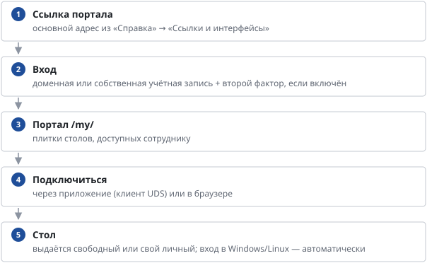

# Как сотрудник подключается к столу

*Начало работы → Сотрудники и доступ · обновлено 05.10.2026*

> Что видит сотрудник: ссылка портала, вход, плитки столов, приложение или браузер.

**Схема текстом:**

1.  **Ссылка портала** — основной адрес из «Справка» → «Ссылки и интерфейсы»
2.  **Вход** — доменная или собственная учётная запись + второй фактор, если включён
3.  **Портал /my/** — плитки столов, доступных сотруднику
4.  **Подключиться** — через приложение (клиент UDS) или в браузере
5.  **Стол** — выдаётся свободный или свой личный; вход в Windows/Linux — автоматически

**Через приложение** — клиент UDS нашей сборки (Windows, macOS, РЕД ОС, Astra, Альт): все мониторы, звук и микрофон, принтеры, диски, смарт-карты и токены, веб-камера. Ссылки на установщики — внизу страницы портала. На Windows в меню «⋯» доступен и стандартный клиент RDP (mstsc) через тот же туннель.

**В браузере** — без установки (Guacamole, HTML5): буфер обмена, звук, передача файлов, печать в PDF. Токены, смарт-карты и USB-устройства в браузере недоступны. Микрофон в браузере пока не работает — используйте приложение.

**На портале сотрудник также может:** сменить пароль доменной учётной записи; попросить другую конфигурацию стола или диск побольше и попросить не выключать стол по простою (см. «Запросы сотрудников»); применить одобренное изменение в удобное время.

**Что сказать сотруднику:** адрес портала, какой учёткой входить, что данные на временных столах хранятся только в профиле (Документы, Рабочий стол) — **про профили**.

---
[Оглавление](README.md)
