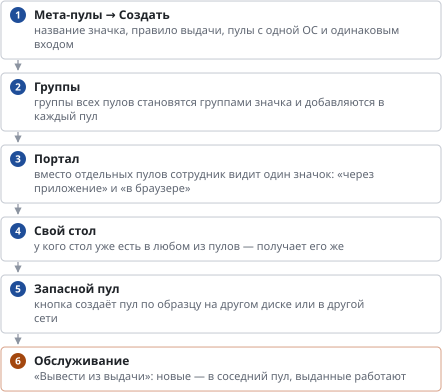

# Мета-пул: один значок, несколько пулов

*Руководство администратора → Образы и пулы*

> Один значок на портале вместо нескольких пулов: запасной пул, вывод из выдачи на обслуживание.

**Схема текстом:**

1.  **Мета-пулы → Создать** — название значка, правило выдачи, пулы с одной ОС и одинаковым входом
2.  **Группы** — группы всех пулов становятся группами значка и добавляются в каждый пул
3.  **Портал** — вместо отдельных пулов сотрудник видит один значок: «через приложение» и «в браузере»
4.  **Свой стол** — у кого стол уже есть в любом из пулов — получает его же
5.  **Запасной пул** — кнопка создаёт пул по образцу на другом диске или в другой сети
6.  **Обслуживание** — «Вывести из выдачи»: новые — в соседний пул, выданные работают (внимание)

---
[Оглавление](README.md)
