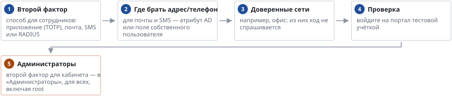

# Второй фактор при входе

*Руководство администратора → Безопасность*

> Второй фактор при входе сотрудников на портал: приложение, почта, SMS, RADIUS.

**Схема текстом:**

1.  **Второй фактор** — способ для сотрудников: приложение (TOTP), почта, SMS или RADIUS
2.  **Где брать адрес/телефон** — для почты и SMS — атрибут AD или поле собственного пользователя
3.  **Доверенные сети** — например, офис: из них код не спрашивается
4.  **Проверка** — войдите на портал тестовой учёткой
5.  **Администраторы** — второй фактор для кабинета — в «Администраторы», для всех, включая root (внимание)

Потерянный телефон с приложением: сбросьте привязку на странице «Второй фактор» (UDS сам забывает её только при удалении пользователя вместе со столами). Если root потерял телефон — сброс командой на сервере панели, она указана на странице «Администраторы».

---
[Оглавление](README.md)
