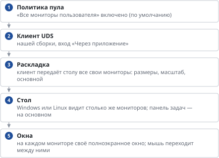

# Несколько мониторов у сотрудника

*Руководство администратора → Сотрудники и доступ*

> Как сотрудник работает на двух и более мониторах и что для этого включить.

**Схема текстом:**

1.  **Политика пула** — «Все мониторы пользователя» включено (по умолчанию)
2.  **Клиент UDS** — нашей сборки, вход «Через приложение»
3.  **Раскладка** — клиент передаёт столу все свои мониторы: размеры, масштаб, основной
4.  **Стол** — Windows или Linux видит столько же мониторов; панель задач — на основном
5.  **Окна** — на каждом мониторе своё полноэкранное окно; мышь переходит между ними

Работает на Windows, macOS и Linux у сотрудника; мониторы могут быть разными (например, Retina ноутбука и обычный внешний) — у каждого свой масштаб. Мониторы располагаются рядом слева направо или один над другим — как они стоят у сотрудника.

**Сотруднику:** на верхней панели сеанса кнопка «Один экран / Все экраны» — выбор запоминается для этого набора мониторов; «Полный экран» переводит стол в обычное окно на одном экране, «Свернуть» — убирает окна сеанса.

**Windows RDP (mstsc):** сотрудникам с Windows-компьютером в меню «⋯» на портале доступен стандартный клиент Windows — он тоже открывает стол на всех мониторах (параметр `use multimon`) и идёт через тот же туннель UDS. Включается в настройках пула с Windows-образом; на macOS и Linux пункт не показывается. Устройства (диски, принтеры, токены, камера, буфер) берутся из той же политики подключения.

**Ограничения:** раскладка задаётся при подключении — подключили или сняли монитор во время работы: переподключитесь. Вход «В браузере» всегда показывает стол в одном окне браузера.

**Как проверить:** подключитесь к столу и выполните в нём `powershell "Add-Type -A System.Windows.Forms; [Windows.Forms.Screen]::AllScreens | ft DeviceName,Bounds,Primary"` (Windows) или `xrandr --listmonitors` (Linux): мониторов должно быть столько же, сколько у сотрудника.

---
[Оглавление](README.md)
