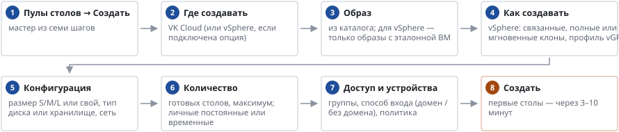

# Как создать пул столов

*Руководство администратора → Образы и пулы*

> Мастер создания пула: платформа, образ, размер, количество, доступ и устройства.

Личные постоянные — стол закрепляется за сотрудником и сохраняет всё; временные чистые — после выхода стол удаляется и создаётся заново (данные — только в профиле S3); временные с возвратом — стол после выхода достаётся следующему. Сеть и группу безопасности для групп AD можно задать заранее: «Пользователи» → «Размещение столов по группам».

---
[Оглавление](README.md)
