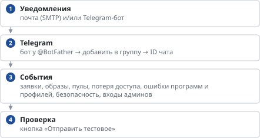

# Уведомления администраторам

*Руководство администратора → Ежедневная работа*

> Какие события приходят администраторам на почту и в мессенджеры.

**Схема текстом:**

1.  **Уведомления** — почта (SMTP) и/или Telegram-бот
2.  **Telegram** — бот у @BotFather → добавить в группу → ID чата
3.  **События** — заявки, образы, пулы, потеря доступа, ошибки программ и профилей, безопасность, входы админов
4.  **Проверка** — кнопка «Отправить тестовое»

Брокеру нужен выход к почтовому серверу и к api.telegram.org. Пароли и токены хранятся на сервере панели и в кабинете не показываются.

---
[Оглавление](README.md)
