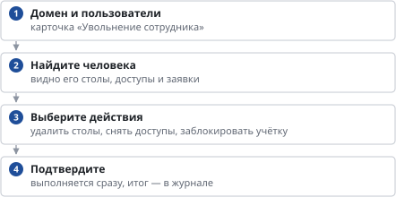

# Как отключить уволенного сотрудника

*Руководство администратора → Сотрудники и доступ*

> Снять доступы, удалить столы и заблокировать учётную запись уволенного сотрудника за один шаг.

**Схема текстом:**

1.  **Домен и пользователи** — карточка «Увольнение сотрудника»
2.  **Найдите человека** — видно его столы, доступы и заявки
3.  **Выберите действия** — удалить столы, снять доступы, заблокировать учётку
4.  **Подтвердите** — выполняется сразу, итог — в журнале

Если сотрудника убрали из групп в AD или заблокировали, панель сама заметит это при ежечасной сверке: стол выключится и будет удалён через 14 дней, если права не вернутся.

---
[Оглавление](README.md)
