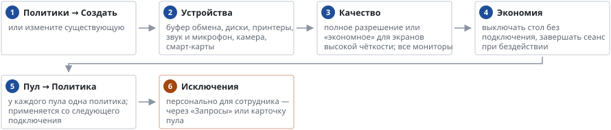

# Политики: устройства, качество, экономия

*Руководство администратора → Сотрудники и доступ*

> Какие устройства разрешены в сеансе и с каким качеством картинки работает пул.

**Схема текстом:**

1.  **Политики → Создать** — или измените существующую
2.  **Устройства** — буфер обмена, диски, принтеры, звук и микрофон, камера, смарт-карты
3.  **Качество** — полное разрешение или «экономное» для экранов высокой чёткости; все мониторы
4.  **Экономия** — выключать стол без подключения, завершать сеанс при бездействии
5.  **Пул → Политика** — у каждого пула одна политика; применяется со следующего подключения
6.  **Исключения** — персонально для сотрудника — через «Запросы» или карточку пула (внимание)

Сканеры штрихкода в режиме клавиатуры работают всегда. Произвольные USB и COM-устройства не пробрасываются — ККТ подключайте по сети. В браузере (HTML5) часть устройств недоступна — см. «Как сотрудник подключается». Если экономия задана в политике, в карточке пула она только для чтения.

---
[Оглавление](README.md)
