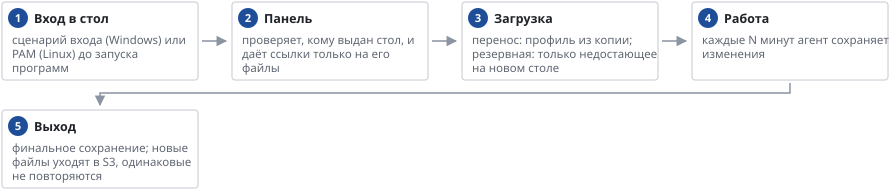

# Профили пользователей в S3

*Руководство администратора → Сотрудники и доступ*

> Профили пользователей хранятся в S3 и приезжают на любой стол сотрудника.

**Что сохраняется.** Windows: пользовательские папки, браузеры (без кэшей), подписи и шаблоны Office, настройки 1С, выбранные ветки реестра HKCU (раскладки, мышь, Проводник, Office). Сам файл реестра NTUSER.DAT не переносится — это полный профиль, как у Citrix, отдельный этап. Linux: домашний каталог без кэшей, корзины и подключённых дисков клиента.

**Хранение.** Каждый файл хранится один раз (по контрольной сумме SHA-256), копия профиля — это список файлов. Последние 2 дня хранятся все копии, дальше — одна в день до срока хранения. На столах нет ключей хранилища: агент получает от панели одноразовые ссылки на 6 часов только к файлам сотрудника, которому брокер выдал этот стол.

**Восстановление.** В разделе «Профили пользователей» → «Копии»: «В папку» — файлы выбранной копии появляются на рабочем столе сотрудника в папке «Восстановленные файлы»; «Заменить при входе» — при следующем входе профиль заменяется копией.

**Агент.** Тот же, что для «Программ и настроек»; обновляется сам. На Windows он добавляет в локальную групповую политику сценарии входа и выхода и включает синхронный запуск сценариев входа; на Linux — строку pam_exec в /etc/pam.d/xrdp-sesman. Журнал: %LOCALAPPDATA%\VDIAgent\agent.log и ~/.cache/vdi-agent/agent.log.

**Ограничения:** если сотрудник одновременно работает в двух столах с одной ОС, последняя сохранённая копия — от того стола, где он вышел позже (история сохраняется). Открытые базы программ (например, почта Outlook .ost) не сохраняются.

---
[Оглавление](README.md)
