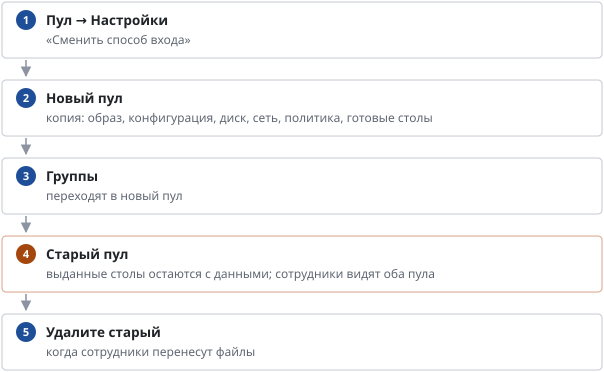

# Как сменить способ входа пула (домен ↔ без домена)

*Руководство администратора → Сотрудники и доступ*

> Перевод пула со входа доменной учёткой на локальную и обратно.

**Схема текстом:**

1.  **Пул → Настройки** — «Сменить способ входа»
2.  **Новый пул** — копия: образ, конфигурация, диск, сеть, политика, готовые столы
3.  **Группы** — переходят в новый пул
4.  **Старый пул** — выданные столы остаются с данными; сотрудники видят оба пула (внимание)
5.  **Удалите старый** — когда сотрудники перенесут файлы

Способ входа нельзя поменять у существующего пула: столы уже введены (или не введены) в домен. Вход без домена требует в образе локальную учётку (vdiuser) — её создаёт команда подготовки.

---
[Оглавление](README.md)
