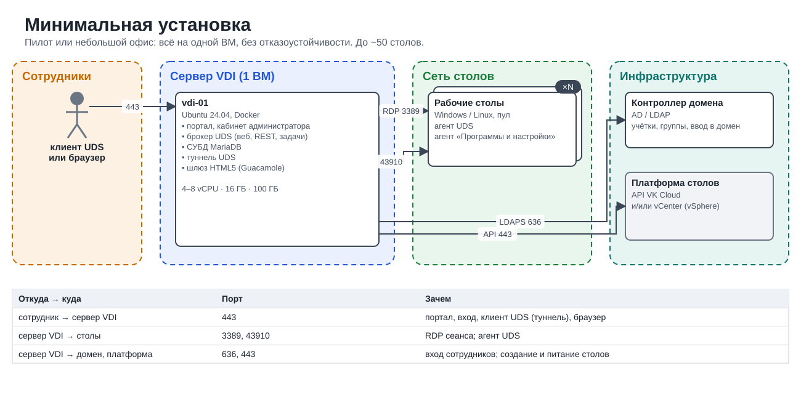
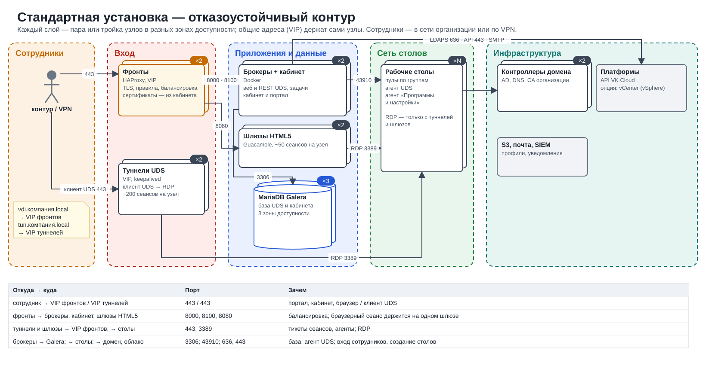
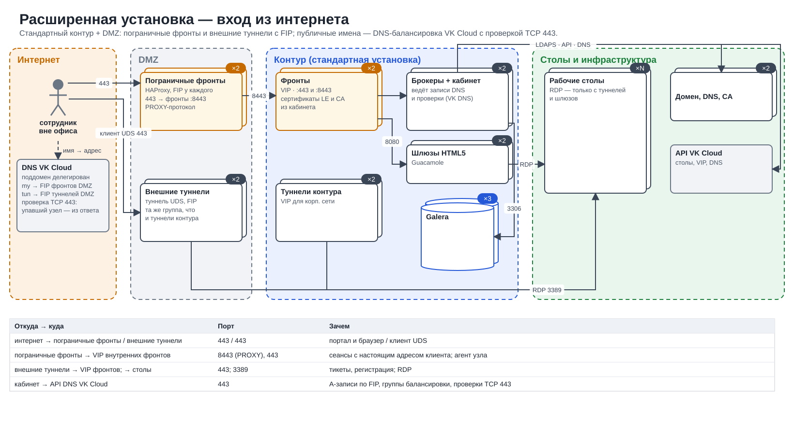
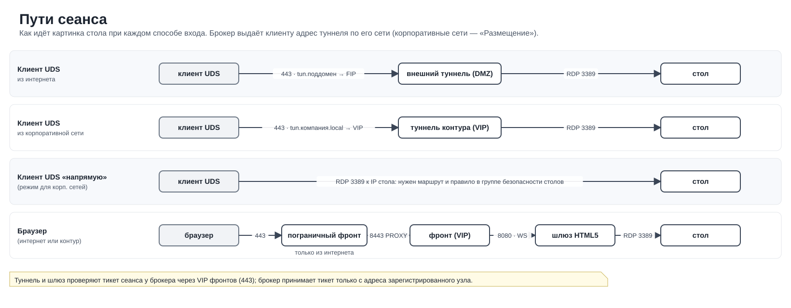

# Схемы архитектуры

*Как устроено*

> Схемы размещения по профилям установки: какие сети нужны, что в них стоит и как идёт картинка стола.

Целевая схема размещения в проекте VK Cloud организации: какие сети нужны, что в них стоит, какие порты открыты и через что идёт картинка рабочего стола.

**Минимальная установка** — всё на одной ВМ: пилот или небольшой офис. Нажмите, чтобы открыть в полном размере.

**Стандартная установка — отказоустойчивый контур** — фронты и туннели с VIP, брокеры с кабинетом, Galera ×3, шлюзы HTML5. Нажмите, чтобы открыть в полном размере.

**Расширенная установка — вход из интернета** — DMZ с пограничными фронтами и внешними туннелями, публичные имена в DNS VK Cloud с проверками. Нажмите, чтобы открыть в полном размере.

**Пути сеанса** — как идёт картинка стола: клиент UDS из интернета, из контура, напрямую и браузер. Нажмите, чтобы открыть в полном размере.

### Опция: VMware vSphere на выделенных серверах

- Основная схема — столы в VK Cloud. Если заказчику нужен свой VMware vSphere (например, для NVIDIA vGPU), он разворачивает ESXi и vCenter сам на выделенных серверах VK Cloud Bare Metal as a Service со своими лицензиями VMware; CloudUDS подключается к этому vCenter как ещё одна платформа столов.
- Сеть управления ESXi и vCenter — отдельная; сети столов приходят на серверы VLAN-ами (порт-группы распределённого коммутатора).
- Столы vSphere подключаются к той же сети столов, что и облачные: брокер, туннели, шлюзы и контроллеры домена у них общие; адреса выдаёт DHCP в сети столов (облачный DHCP машинам VMware адреса не даёт).
- Брокеру UDS нужен доступ к vCenter по 443; остальные сети столов и приложений в сеть управления не маршрутизируются.
- Картинка стола идёт тем же путём: туннель UDS или HTML5-шлюз → RDP на стол; платформа на поток не влияет.

---
[Оглавление](README.md)
