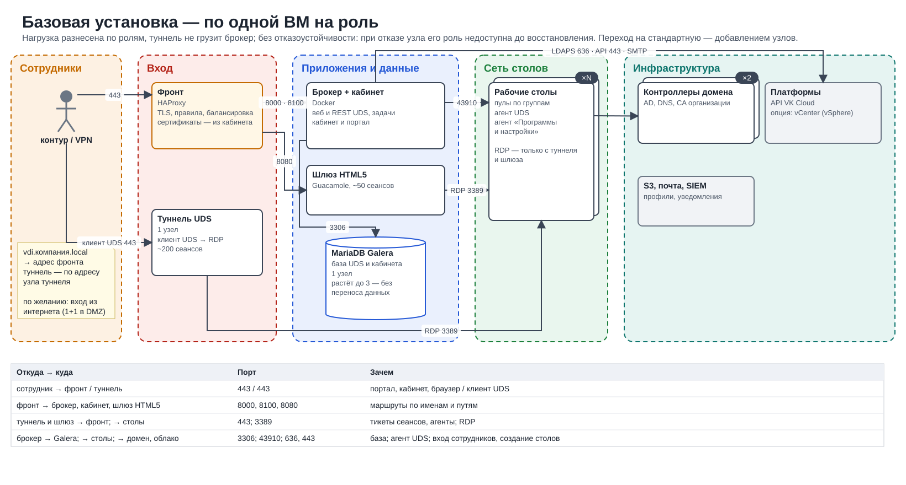

# Схемы архитектуры

*Как устроено*

> Схемы размещения по профилям инсталляции: какие сети нужны, что в них стоит и как идёт картинка стола.

Целевая схема размещения в проекте VK Cloud организации: какие сети нужны, что в них стоит, какие порты открыты и через что идёт картинка рабочего стола.

**Минимальная установка** — всё на одной ВМ: пилот или небольшой офис. Нажмите, чтобы открыть в полном размере.

**Схема текстом:**

- **Сотрудники** подключаются клиентом UDS или из браузера к серверу VDI по 443.
- **Сервер VDI** — одна ВМ (Ubuntu 24.04, Docker; 8 vCPU, 16 ГБ, 100 ГБ): портал и кабинет администратора, брокер UDS (веб, REST, задачи), СУБД MariaDB, туннель UDS, шлюз HTML5 (Guacamole).
- **Сеть столов** — рабочие столы Windows и Linux из пулов, на каждом агент UDS и агент «Программы и настройки»; сервер ходит к ним по RDP 3389 и к агенту UDS по 43910.
- **Инфраструктура** — контроллер домена (AD / LDAP: учётные записи, группы, ввод в домен) по LDAPS 636 и платформа столов: API VK Cloud по 443 (в опции — vCenter).

| Откуда → куда | Порт | Зачем |
|----|----|----|
| сотрудник → сервер VDI | `443` | портал, вход, клиент UDS (туннель), браузер |
| сервер VDI → столы | `3389, 43910` | RDP сеанса; агент UDS |
| сервер VDI → домен, платформа | `636, 443` | вход сотрудников; создание и питание столов |

**Базовая установка — по одной ВМ на роль** — нагрузка разнесена по ролям, без отказоустойчивости. Нажмите, чтобы открыть в полном размере.

**Схема текстом:**

- По одной ВМ на роль: нагрузка разнесена, туннель не грузит брокер; отказоустойчивости нет — при отказе узла его роль недоступна до восстановления. Переход на стандартную — добавлением узлов.
- **Сотрудники** из сети организации или по VPN: портал по внутреннему имени (vdi.компания.local) → адрес фронта, клиент UDS → адрес узла туннеля. По желанию — вход из интернета (по одному пограничному фронту и внешнему туннелю в DMZ).
- **Вход:** фронт (HAProxy: TLS, правила, балансировка; сертификаты — из кабинета) и туннель UDS (клиент UDS → RDP, ~200 сеансов).
- **Приложения и данные:** брокер с кабинетом и порталом (Docker), шлюз HTML5 (Guacamole, ~50 сеансов), MariaDB Galera на одном узле (растёт до трёх без переноса данных).
- **Сеть столов:** столы пулов с агентами; RDP — только с туннеля и шлюза.
- **Инфраструктура:** контроллеры домена (AD, DNS, CA организации), API VK Cloud (в опции — vCenter), S3, почта и SIEM (профили, уведомления).

| Откуда → куда | Порт | Зачем |
|----|----|----|
| сотрудник → фронт / туннель | `443 / 443` | портал, кабинет, браузер / клиент UDS |
| фронт → брокер, кабинет, шлюз HTML5 | `8000, 8100, 8080` | маршруты по именам и путям |
| туннель и шлюз → фронт; → столы | `443; 3389` | тикеты сеансов, агенты; RDP |
| брокер → Galera; → столы; → домен, облако | `3306; 43910; 636, 443` | база; агент UDS; вход сотрудников, создание столов |

**Стандартная установка — отказоустойчивый контур** — фронты и туннели с VIP, брокеры с кабинетом, Galera ×3, шлюзы HTML5. Нажмите, чтобы открыть в полном размере.

**Схема текстом:**

- Каждый слой — пара или тройка узлов в разных зонах доступности; общие адреса (VIP) держат сами узлы. Сотрудники — в сети организации или по VPN.
- **Сотрудники:** vdi.компания.local → VIP фронтов, tun.компания.local → VIP туннелей.
- **Вход:** фронты ×2 (HAProxy, VIP: TLS, правила, балансировка; сертификаты — из кабинета) и туннели UDS ×2 (VIP, keepalived; клиент UDS → RDP, ~200 сеансов на узел).
- **Приложения и данные:** брокеры с кабинетом и порталом ×2 (Docker), шлюзы HTML5 ×2 (Guacamole, ~50 сеансов на узел), MariaDB Galera ×3 в трёх зонах (база UDS и кабинета).
- **Сеть столов:** столы пулов по группам с агентами; RDP — только с туннелей и шлюзов.
- **Инфраструктура:** контроллеры домена ×2 (AD, DNS, CA организации), API VK Cloud (в опции — vCenter), S3, почта и SIEM.

| Откуда → куда | Порт | Зачем |
|----|----|----|
| сотрудник → VIP фронтов / VIP туннелей | `443 / 443` | портал, кабинет, браузер / клиент UDS |
| фронты → брокеры, кабинет, шлюзы HTML5 | `8000, 8100, 8080` | балансировка; браузерный сеанс держится на одном шлюзе |
| туннели и шлюзы → VIP фронтов; → столы | `443; 3389` | тикеты сеансов, агенты; RDP |
| брокеры → Galera; → столы; → домен, облако | `3306; 43910; 636, 443` | база; агент UDS; вход сотрудников, создание столов |

**Расширенная установка — вход из интернета** — DMZ с пограничными фронтами и внешними туннелями, публичные имена в DNS VK Cloud с проверками. Нажмите, чтобы открыть в полном размере.

**Схема текстом:**

- Стандартный контур + DMZ: пограничные фронты и внешние туннели с плавающими IP; публичные имена — DNS-балансировка VK Cloud с проверкой TCP 443.
- **Интернет:** сотрудник вне офиса находит адреса через DNS VK Cloud (поддомен делегирован): my → FIP пограничных фронтов, tun → FIP внешних туннелей; узел, не прошедший проверку TCP 443, исключается из ответа.
- **DMZ:** пограничные фронты ×2 (HAProxy, FIP у каждого; 443 → внутренние фронты :8443 по PROXY-протоколу) и внешние туннели ×2 (туннель UDS, FIP; та же группа, что и туннели контура).
- **Контур:** фронты ×2 (VIP, :443 и :8443; сертификаты Let's Encrypt и CA организации — из кабинета), брокеры с кабинетом ×2 (кабинет ведёт записи и проверки VK DNS), туннели контура ×2 (VIP для сети организации), шлюзы HTML5 ×2, Galera ×3.
- **Столы и инфраструктура:** столы (RDP — только с туннелей и шлюзов), контроллеры домена, DNS и CA ×2, API VK Cloud (столы, VIP, DNS).

| Откуда → куда | Порт | Зачем |
|----|----|----|
| интернет → пограничные фронты / внешние туннели | `443 / 443` | портал и браузер / клиент UDS |
| пограничные фронты → VIP внутренних фронтов | `8443 (PROXY), 443` | сеансы с настоящим адресом клиента; агент узла |
| внешние туннели → VIP фронтов; → столы | `443; 3389` | тикеты, регистрация; RDP |
| кабинет → API DNS VK Cloud | `443` | A-записи по FIP, группы балансировки, проверки TCP 443 |

**Пути сеанса** — как идёт картинка стола: клиент UDS из интернета, из контура, напрямую и браузер. Нажмите, чтобы открыть в полном размере.

**Схема текстом:**

- Брокер выдаёт клиенту адрес туннеля по его сети (корпоративные сети задаются в «Размещении»).
- **Клиент UDS из интернета:** клиент → внешний туннель в DMZ (443, tun.поддомен → FIP) → стол (RDP 3389).
- **Клиент UDS из сети организации:** клиент → туннель контура (443, tun.компания.local → VIP) → стол (RDP 3389).
- **Клиент UDS «напрямую»** (режим для корпоративных сетей): клиент → стол по RDP 3389 к IP стола; нужен маршрут и правило в группе безопасности столов.
- **Браузер** (интернет или контур): браузер → пограничный фронт (только из интернета, 443) → фронт (VIP; от пограничного — 8443 PROXY) → шлюз HTML5 (8080, WebSocket) → стол (RDP 3389).
- Туннель и шлюз проверяют тикет сеанса у брокера через VIP фронтов (443); брокер принимает тикет только с адреса зарегистрированного узла.

| Откуда → куда | Порт | Зачем |
|----|----|----|
| клиент UDS → внешний туннель / туннель контура | `443` | сеанс клиента UDS |
| туннель → стол | `3389` | RDP |
| клиент UDS → стол («напрямую») | `3389` | RDP без туннеля |
| браузер → пограничный фронт → фронт | `443 → 8443 (PROXY)` | вход из интернета |
| фронт → шлюз HTML5 → стол | `8080 (WebSocket) → 3389` | браузерный сеанс |
| туннель, шлюз → VIP фронтов | `443` | проверка тикета у брокера |

### Опция: VMware vSphere на выделенных серверах

- Основная схема — столы в VK Cloud. Если заказчику нужен свой VMware vSphere (например, для NVIDIA vGPU), он разворачивает ESXi и vCenter сам на выделенных серверах VK Cloud Bare Metal as a Service со своими лицензиями VMware; CloudUDS подключается к этому vCenter как ещё одна платформа столов.
- Сеть управления ESXi и vCenter — отдельная; сети столов приходят на серверы VLAN-ами (порт-группы распределённого коммутатора).
- Столы vSphere подключаются к той же сети столов, что и облачные: брокер, туннели, шлюзы и контроллеры домена у них общие; адреса выдаёт DHCP в сети столов (облачный DHCP машинам VMware адреса не даёт).
- Брокеру UDS нужен доступ к vCenter по 443; остальные сети столов и приложений в сеть управления не маршрутизируются.
- Картинка стола идёт тем же путём: туннель UDS или HTML5-шлюз → RDP на стол; платформа на поток не влияет.

---
[Оглавление](README.md)
