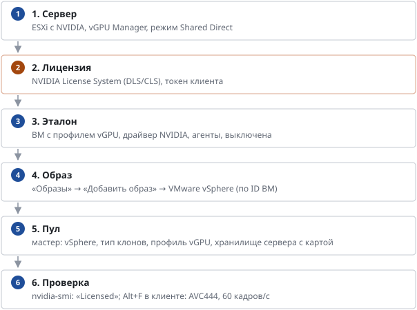

# Столы с видеокартой (vGPU) в vSphere

*Руководство администратора → Образы и пулы · обновлено 07.10.2026*

> Весь путь от сервера с видеокартой NVIDIA до стола сотрудника: лицензия, эталон, пул, настройка графики RDP.

Стол с NVIDIA vGPU получает часть видеокарты сервера: свою видеопамять (1–16 ГБ) и долю вычислений. Нужен для CAD/BIM (Revit, AutoCAD), 3D, видео и тяжёлых браузерных приложений. Ниже — весь путь от сервера до стола сотрудника.

### 1. Сервер (делает администратор vSphere)

1.  На ESXi установлен **NVIDIA vGPU Manager** (VIB) — версия должна совпадать с веткой гостевого драйвера (например, vGPU 19.x на хосте и драйвер 19.x в столе).
2.  Графика хоста: Host → Configure → Graphics → Host Graphics — **Shared Direct**; у карты — тот же режим. После смены — перезагрузка хоста.
3.  Проверка: nvidia-smi в ESXi Shell видит карты; в панели на странице «Размещение» у хранилищ этого сервера появляются профили vGPU.
4.  У служебной учётной записи арендатора — пул ресурсов в кластере сервера с картами (например vdi-gpu в кластере с GPU): брокер сам выбирает его по хранилищу.

### 2. Лицензия NVIDIA

vGPU — лицензируемый продукт NVIDIA: профили **B** требуют лицензии **vPC**, профили **Q** — **RTX vWS**. Лицензии выдаёт официальная **NVIDIA License System**: облачная (CLS) или локальная (DLS, виртуальная машина от NVIDIA). Из портала NVIDIA Licensing скачивается *client configuration token*; его кладут в эталон в C:\Program Files\NVIDIA Corporation\vGPU Licensing\ClientConfigToken\\, и каждый стол получает лицензию сам при старте. **Без лицензии** стол работает, но через ~20 минут драйвер ограничивает частоту кадров и производительность — для тестов производительности и работы сотрудников это неприемлемо. Эмуляторы сервера лицензий не используйте: это нарушение лицензии NVIDIA.

### 3. Эталонная ВМ

1.  Создайте ВМ Windows 11 в папке арендатора **на хранилище сервера с картами**; VMware Tools обязательны.
2.  Edit Settings → Add New Device → PCI Device → NVIDIA GRID vGPU, профиль (например, grid_t4-2b). Память: **Reserve all guest memory (All locked)** — без полного резервирования ВМ с vGPU не включится.
3.  Установите гостевой драйвер **NVIDIA vGPU (GRID) для Windows** той же ветки, что и vGPU Manager, и положите токен лицензии (шаг 2). Консоль vCenter после драйвера может показывать чёрный экран — работайте по RDP.
4.  Выполните команду подготовки из «Образы» → «Свой образ»: агент UDS 5, RDP, учётка vdiuser. Для синхронизации профилей — агент профилей (раздел «Агенты»). Для **мгновенных клонов** — скрипт images/windows/uds-instantclone.ps1.
5.  Затем команда из «Образы» → **«Столы с vGPU: настройка графики»**: сессия RDP рисуется и сжимается видеокартой, режим AVC444 (чёткие тонкие линии), 60 или 30 кадров/с. Без неё Windows рисует RDP без видеокарты, в AVC420 и не больше 30 кадров/с. Перезагрузите ВМ.
6.  Установите программы (Office, Revit…), выключите ВМ. Снимок делать не нужно — брокер делает свой в каждой версии пула.

### 4. Образ в каталоге

«Образы» → «Добавить образ» → **VMware vSphere**: выберите ВМ из списка или вставьте её ID (vm-…) либо UUID. Панель покажет vCPU, память, диски, профиль vGPU, снимки и предупредит, если ВМ включена или без VMware Tools. Образ закрепляется за ВМ по ID, поэтому переименование ВМ ничего не ломает, а после перерегистрации в vCenter эталон находится по UUID. Ничего не копируется — образ доступен в мастере сразу.

### 5. Пул

1.  «Пулы столов» → «Создать пул» → платформа **VMware vSphere**, образ с эталоном.
2.  **Тип клонов:** связанные — быстрые и экономные (рекомендуем); полные — независимые диски; мгновенные — стол за секунды из памяти «замороженной» копии (нужен скрипт мгновенных клонов в эталоне; родитель постоянно держит память и долю карты).
3.  **Профиль vGPU:** «как у эталона», другой профиль той же карты или «без vGPU». Один эталон годится для пулов с разными профилями — профиль задаётся версии пула.
4.  **Размер:** «Как у эталона» (память уже зарезервирована под vGPU) или готовый размер.
5.  **Хранилище:** мастер показывает только хранилища серверов, где есть выбранный профиль. Столы живут на том же сервере, что и версия пула.
6.  Группы доступа: например, группа AD vGPU-T4-Users — пул увидят только её участники.

### Какой профиль выбрать (NVIDIA T4, 16 ГБ)

| Профиль | Лицензия | Для чего | Столов на карту |
|----|----|----|----|
| T4-1B | vPC | офис, браузер, видеосвязь, 1–2 монитора HD | 16 |
| T4-2B | vPC | офис «с запасом», 2 монитора 4K, лёгкая графика | 8 |
| T4-2Q | RTX vWS | CAD/BIM начального уровня: AutoCAD, Revit на небольших моделях | 8 |
| T4-4Q | RTX vWS | Revit, 3ds Max, крупные модели | 4 |
| T4-8Q / 16Q | RTX vWS | рендер, тяжёлые сцены, ML-инференс | 2 / 1 |

На одной физической карте одновременно работают столы только одного размера профиля: пул T4-2B и пул T4-4Q на одном сервере с двумя картами займут по карте. Ёмкость сервера = карты × (16 ГБ / размер профиля).

### 6. Проверка в столе

1.  nvidia-smi — видна карта с именем профиля (например, GRID T4-2B).
2.  nvidia-smi -q \| findstr /i "License" — **Licensed**; если «Unlicensed» — проверьте токен и доступ стола к серверу лицензий.
3.  Диспетчер задач → Производительность → GPU: нагрузка растёт при работе в приложении. Для Revit — RFO Benchmark (нужна лицензия Revit).

**Типичные ошибки:** «пул ресурсов не найден» — у арендатора нет пула ресурсов в кластере сервера с картами; ВМ не включается — не зарезервирована вся память или профиль не предлагает ни один хост; низкий FPS через 20 минут — нет лицензии; в браузере нет ускорения — вход «В браузере» передаёт картинку через HTML5, для графики лучше «Через приложение».

---
[Оглавление](README.md)
