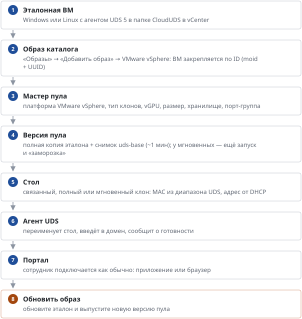

# Пулы в VMware vSphere

*Руководство администратора → Образы и пулы*

> Столы на серверах VMware ESXi под управлением vCenter: эталонная ВМ, типы клонов, vGPU, изоляция арендатора.

Кроме облака VK Cloud, столы можно создавать на выделенных серверах VMware ESXi под управлением vCenter. Платформа выбирается в мастере создания пула; дальше пул живёт так же, как облачный: группы, персональный доступ, политики, экономия, поиск, портал.

**Типы клонов**

**Связанный** — диск стола хранит только отличия от снимка версии пула: создаётся за 1–2 минуты, места почти не занимает. **Полный** — независимая копия диска: дольше и занимает весь объём, но стол не зависит от версии пула. **Мгновенный** (Instant Clone) — версия пула запускается и «замораживается» скриптом эталона (images/windows/uds-instantclone.ps1), каждый стол стартует из её памяти за секунды, дальше агент UDS переименовывает его и вводит в домен; замороженная версия постоянно держит свою память и vGPU. Без общего хранилища версия пула и все её столы живут на одном сервере и хранилище.

**Видеокарта (NVIDIA vGPU)**

Профиль задаётся версии пула: «как у эталона», «без vGPU» или любой профиль, который предлагают серверы (например, T4-2B — офисный стол 2 ГБ, T4-2Q — графическая станция 2 ГБ). Один эталон с драйвером NVIDIA годится для всех профилей. Мастер показывает только хранилища серверов с выбранным профилем; память стола с vGPU резервируется целиком. Лицензию vGPU столы получают от сервера лицензий NVIDIA (токен клиента в эталоне) — без неё через 20 минут падает производительность.

**Размер и сеть**

vCPU и память задаются версии пула (готовые размеры S/M/L): смена выпускает новую версию. Порт-группа применяется к каждому новому столу. Адреса выдаёт DHCP сети арендатора (облачный DHCP машинам VMware адреса не даёт).

**Питание и экономия**

Включение, выключение, перезагрузка и выключение по простою идут через UDS — так же, как в облаке. Мягкое выключение — через VMware Tools; если их нет, стол выключается по питанию.

**Изоляция арендатора**

Служебная учётная запись vCenter видит только папку, пул ресурсов, хранилища и порт-группы своего арендатора; vCenter доступен столам и брокеру только через шлюз арендатора. Подключение и проверка — «Размещение», права — «Учётные записи и права».

**Пока нет:** мгновенные клоны для Linux-эталонов, вход без домена на Windows-эталоне vSphere (нужна локальная учётка vdiuser в эталоне), эталоны РЕД ОС и Astra в vSphere, выбор хранилища для каждого стола.

---
[Оглавление](README.md)
